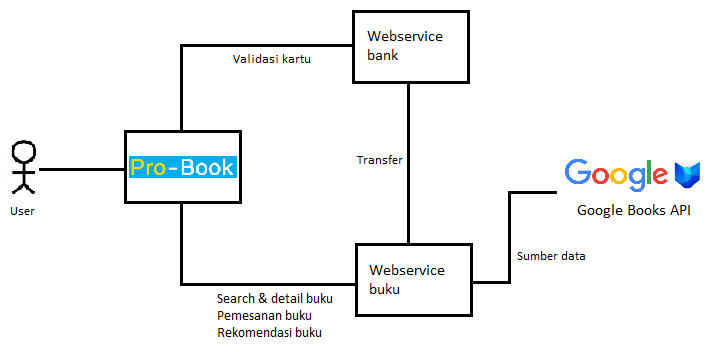

# Tugas 2 IF3110 Pengembangan Aplikasi Berbasis Web 

## Deskripsi Aplikasi

Arsitektur aplikasi memanfaatkan 2 buah webservice, yaitu webservice bank dan webservice buku. Baik aplikasi maupun kedua webservice, masing-masing memiliki database sendiri. 

#### Webservice bank

Webservice bank menyediakan service untuk validasi nomor kartu dan transfer. Webservice bank diimplementasikan menggunakan protokol **REST**.
- Service validasi nomor kartu dilakukan dengan memeriksa apakah nomor kartu tersebut ada pada database bank. Jika iya, berarti kartu tersebut valid.
  
- Service transfer menerima input nomor kartu pengirim, penerima, dan jumlah yang ditransfer. Jika saldo mencukupi, maka transfer berhasil dan uang sejumlah tersebut dipindahkan dari pengirim ke penerima. Transaksi tersebut juga dicatat dalam database webservice. Jika saldo tidak mencukupi, maka transaksi ditolak dan tidak dicatat di database.
  
#### Webservice buku

Webservice ini menyediakan daftar buku beserta harganya yang akan digunakan oleh aplikasi pro-book. Webservice buku dibangun di atas **java servlet**. Service yang disediakan webservice ini antara lain adalah pencarian buku, mengambil detail buku, melakukan pembelian, serta memberikan rekomendasi buku sederhana. Webservice ini diimplementasikan menggunakan **JAX-WS dengan protokol SOAP**.

Webservice ini memanfaatkan **Google Books API melalui HttpURLConnection. Tidak diperbolehkan menggunakan Google Books Client Library for Java**. Data-data buku yang dimiliki oleh webservice ini akan mengambil dari Google Books API. 

Detail service yang disediakan webservice ini adalah:

- Pencarian buku menerima keyword judul. Keyword ini akan diteruskan ke Google Books API dan mengambil daftar buku yang mengandung keyword tersebut pada judulnya. Hasil tersebut kemudian dikembalikan pada aplikasi setelah diproses. Proses yang dilakukan adalah menghapus data yang tidak dibutuhkan, menambahkan harga buku jika ada di database, dan mengubahnya menjadi format SOAP.

- Pengambilan detail juga mengambil data dari Google Books API, seperti service search. Baik service ini maupun search, informasi yang akan dikembalikan hanya informasi yang dibutuhkan. Jangan lansung melemparkan semua data yang didapatkan dari Google Books API ke aplikasi. Karena pengambilan detail buku menggunakan ID buku, maka ID buku webservice harus mengikuti ID buku Google Books API. Pada service ini, harga buku juga dicantumkan.

- Webservice ini menangani proses pembelian. Service ini menerima masukan id buku yang dibeli, jumlah yang dibeli, serta nomor rekening user yang membeli buku. Nomor rekening tersebut akan digunakan untuk mentransfer uang sejumlah harga total buku. Jika transfer gagal, maka pembelian buku juga gagal.

  Jumlah buku yang berhasil dibeli dicatat di database. Webservice menyimpan ID buku, kategori (genre), dan jumlah total pembelian buku tersebut. Data ini akan digunakan untuk memberikan rekomendasi. Jika pembelian gagal maka data tidak dicatat pada aplikasi.

- Webservice juga dapat memberikan rekomendasi sederhana. Input dari webservice ini adalah kategori buku. Kategori buku yang dimasukkan boleh lebih dari 1. Buku yang direkomendasikan adalah buku yang memiliki jumlah pembelian total terbanyak yang memiliki kategori yang sama dengan daftar kategori yang menjadi input. Data tersebut didapat dari service yang mencatat jumlah pembelian.
  
  Jika buku dengan kategori tersebut belum ada yang terjual, maka webservice akan mengembalikan 1 buku random dari hasil pencarian pada Google Books API. Pencarian yang dilakukan adalah buku yang memiliki kategori yang sama dengan salah satu dari kategori yang diberikan (random).
  
#### Mekanisme access token
`Access token` berupa string random. Ketika user melakukan login yang valid, sebuah access token di-generate, disimpan dalam database server, dan diberikan kepada browser. Satu `access token` memiliki `expiry time` token (berbeda dengan expiry time cookie) dan hanya dapat digunakan pada 1 *browser/agent* dari 1 *ip address* tempat melakukan login. Sebuah access token mewakilkan tepat 1 user. Sebuah access token dianggap valid jika:
- Access token terdapat pada database server dan dipasangkan dengan seorang user.
- Access token belum expired, yaitu expiry time access token masih lebih besar dari waktu sekarang.
- Access token digunakan oleh browser yang sesuai.
- Access token digunakan dari ip address yang sesuai.

Jika access token tidak ada atau tidak valid, maka aplikasi melakukan *redirect* ke halaman login jika user mengakses halaman selain login atau register. Jika access token ada dan valid, maka user akan di-*redirect* ke halaman search jika mengakses halaman login. Fitur logout akan menghapus access token dari browser dan dari server.

## Basis Data
Terdapat 3 buah basis data yang digunakan pada program ini, yaitu database probooks sebagai database aplikasi, database book sebagai database web-service book, dan database bank sebagai database web-service bank.

### Database Probooks
1. **Tabel User**

Menyimpan data pengguna. Memiliki atribut: `username`, `password`, `name`, `phone`, `address`, `email`, `image`, dan `cardnumber`.

2. **Tabel Ordering**

Menyimpan order yang dilakukan setiap pengguna aplikasi melakukan pembelian. Memiliki atribut:
- `id`: kode id untuk suatu order
- `username`: username user yang melakukan order
- `bookid`: id dari buku yang dibeli
- `count`: jumlah buku yang dibeli
- `date`: waktu saat dilakukan order

3. **Tabel Review**

Menyimpan review terhadap order yang dilakukan pengguna. Memiliki atribut:
- `id`: id suatu review
- `orderid`: foreign key untuk tabel ordering
- `content`: isi dari review
- `rating`: nilai rating yang diberikan

4. **Tabel Session**

Menyimpan data yang dibutuhkan untuk membuat mekanisme akses token. Memiliki atribut:
- `session_id`: Akses token pengguna, berupa string random 32 huruf
- `username`: username dari pengguna, foreign key ke tabel user
- `browser`: user agent yang digunakan pengguna
- `ip_adress`: ip address dari pengguna
- `expire_time`: waktu expire dari suatu sesi

### Database Book
1. **Tabel Penjualan**

Menyimpan data penjualan buku. Memiliki atribut `idbook` sebagai primary key, `harga`, serta `totalpenjualan`.

2. **Tabel Kategori**

Menyimpan kategori buku yang disimpan. Memiliki atribut `id` dan `kategori`. Satu id dapat memiliki beberapa kategori.

### Database Bank
1. **Tabel Nasabah**

Menyimpan data Nasabah. Memiliki atribut:
- `nomor_kartu` - nomor kartu nasabah
- `nama` - nama nasabah
- `saldo` - saldo nasabah

2. **Tabel Transaksi**

Menyimpan transaksi yang dilakukan oleh nasabah. Memiliki atribut:
- `nomor_pengirim`: nomor kartu nasabah pengirim
- `nomor_penerima`: nomor kartu nasabah penerima
- `jumlah`: jumlah transaksi
- `waktu`: waktu transaksi

## REST Shared Session
Respresentational State Transfer (REST) merupakan konsep dalam melakukan shared session pada web yang bersifat stateless. 
Konsep REST:
- resource
- server untuk menampung resource tersebut
- client yang akan melakukan request pada server
- interaksi antara client dan server berupa request dan response
- representasi, yakni dokumen yang berisi status terhadap resource yang bersangkutan

Membuat REST API session mirip dengan melakukan logging menggunakan web browser. Bedanya, diperlukan aplikasi yang mampu mengirim dan menerima permintaan HTTP — client REST. Client REST berbeda dari browser web, meskipun beberapa client REST dibangun di atas browser web seperti Chromium.

## Mekanisme Pembangkitan Token dan Expire Time

1. **Pembangkitan Token**

Token dibangkitkan ketika pengguna berhasil melakukan login ke aplikasi atau berhasil melakukan registerasi. Mekanisme pembangkitan token adalah sebagai berikut.
- Website akan meng-generate sebuah akses token berupa string random 32 huruf. 
- Website mengambil data berupa browser, IP Address, username, serta expire time yaitu 60 menit dari dibuatnya token.
- Akses token, browser, IP Address, username, dan expire time disimpan ke dalam database.
- Akses token dan username disimpan ke cookies untuk di-validasi saat menjalankan aplikasi.

2. **Expire Time**

Setiap session memiliki expire time yang disimpan dalam database. Mekanisme pengecekan expire time adalah sebagai berikut.
- Dilakukan pengambilan sesi yang sudah expire dari database, yaitu session yang memiliki nilai expire_time < waktu sekarang.
- Session yang sudah di expire dihapus dari database.

Pengecekan ini dilakukan saat pengguna me-load halaman apapun pada aplikasi.

## Kelebihan dan Kelemahan Arsitektur

Kelebihan:
1. Aplikasi scalable, secure dan reliable
2. Setiap service berdiri sendiri (kecil kemungkinan terjadinya kegagalan sistem)
3. Setiap services dapat dibangun tanpa ada mengganggu services yang lain
4. Lebih mudah melakukan maintenance

Kelemahan:
1. Perubahan satu entity pada database menyebabkan setiap entity yang sama di setiap database service harus diubah
2. Untuk beberapa kasus, sulit untuk menerapkan perubahan services sehingga perancangan yang matang
3. Deployment yang kompleks, perlu konfigurasi untuk menjalankan setiap services karena memiliki runtime yang berbeda (tidak seperti aplikasi monolitik)
4. Perlu automation yang tinggi dalam melakukan deployment

### Skenario

1. User melakukan registrasi dengan memasukkan informasi nomor kartu.
2. Jika nomor kartu tidak valid, registrasi ditolak dan user akan diminta memasukkan kembali nomor kartu yang valid.
3. User yang sudah teregistrasi dapat mengganti informasi nomor kartu.
4. Ketika user mengganti nomor kartu, nomor kartu yang baru akan diperiksa validasinya melalui webservice bank.
5. Setelah login, user dapat melakukan pencarian buku.
6. Pencarian buku akan mengirim request ke webservice buku. Halaman ini menggunakan AngularJS.
7. Pada halaman detail buku, ada rekomendasi buku yang didapat dari webservice buku. Rekomendasi buku berdasarkan kategori buku yang sedang dilihat.
8. Ketika user melakukan pemesanan buku, aplikasi akan melakukan request transfer kepada webservice bank.
9. Jika transfer berhasil, aplikasi mengirimkan request kepada webservice buku untuk mencatat penjualan buku.
10. Notifikasi muncul menandakan status pembelian, berhasil atau gagal.

